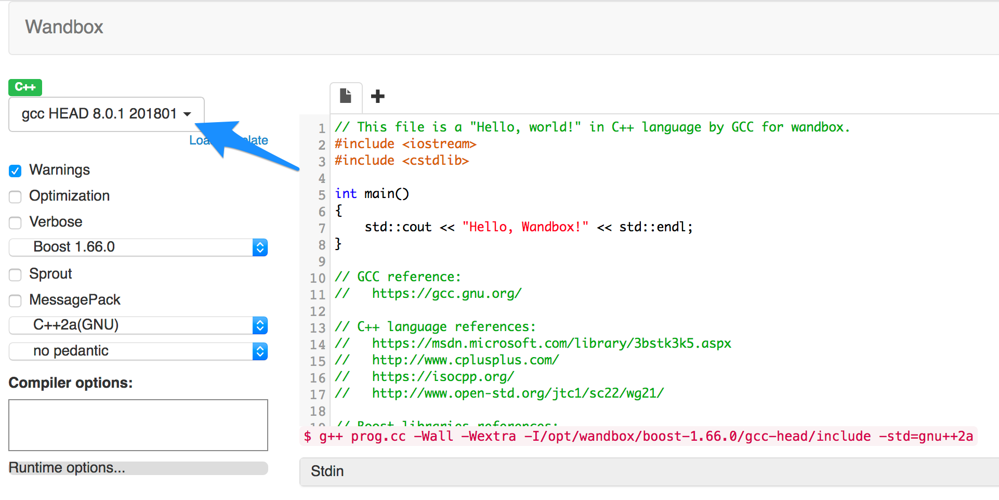
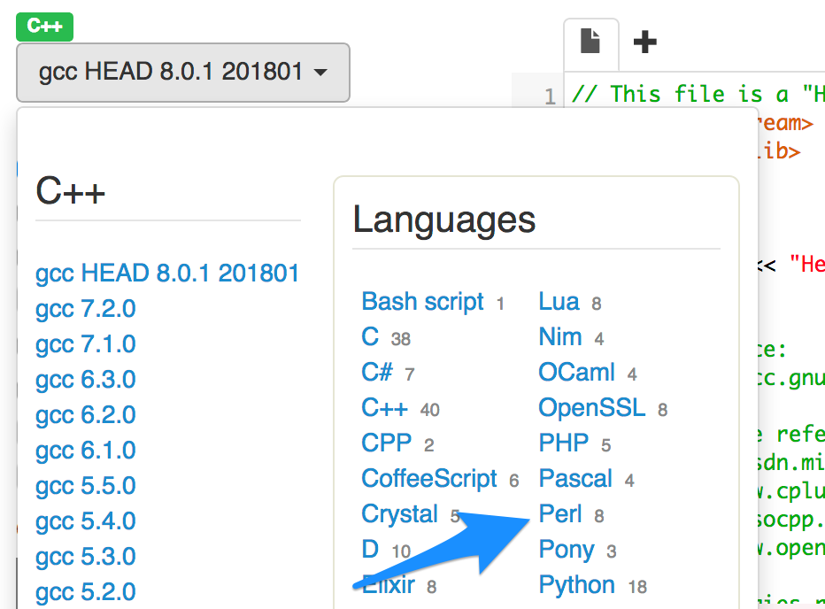
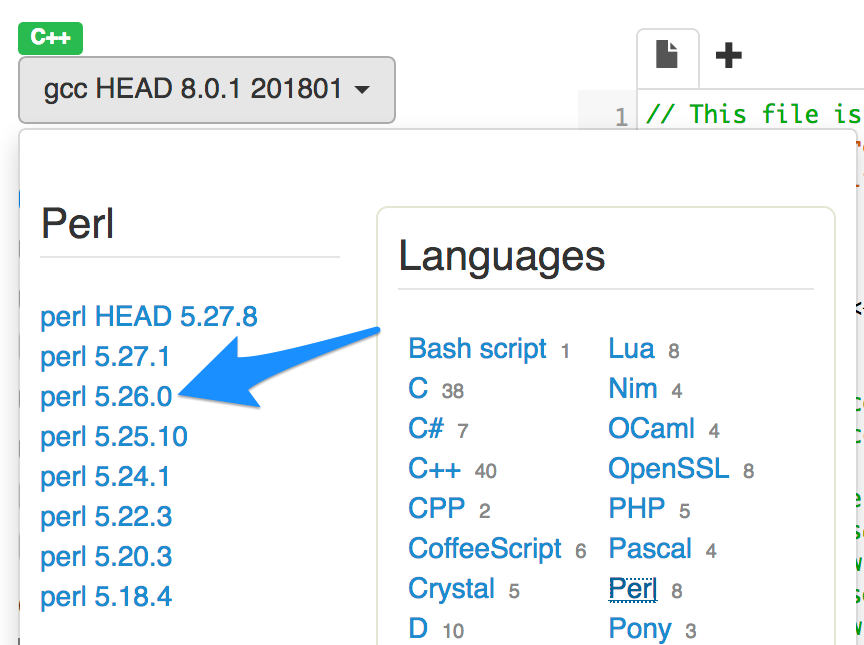
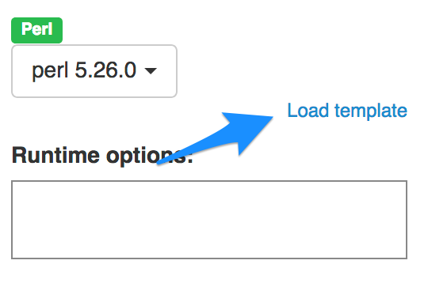
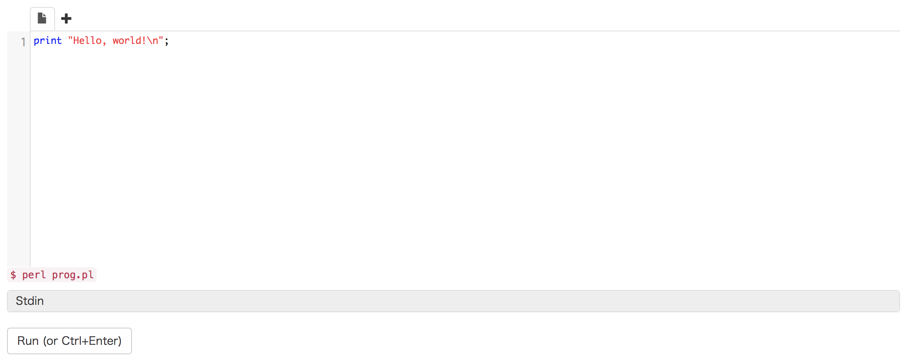
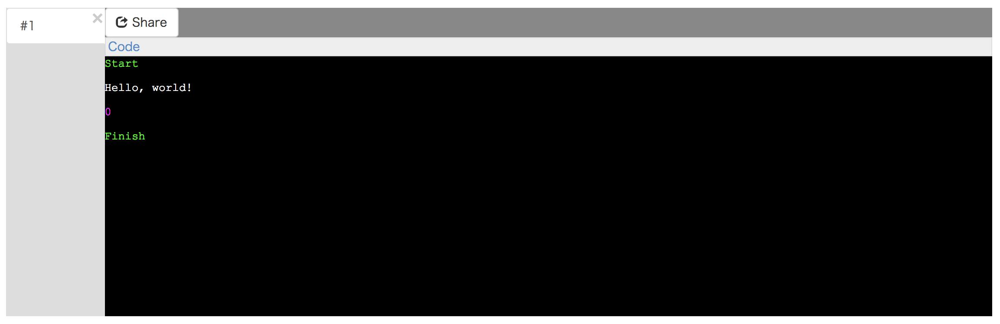

# Wandboxを使ったPerlの実行

Perl入学式では, Perlの構文や, Perlを使って出来ることを学ぶ前半のカリキュラムにおいて, [Wandbox](https://wandbox.org/)を利用します.
Wandboxを利用することで, コンピュータの上にPerlが動作する環境を構築することなく, ブラウザを利用してPerlの基礎を学び始めることができます.

但し, Perl入学式の最後のカリキュラムである, ｢簡単なWebサービスの開発｣においては, 実際にPerlが動作する環境をコンピュータに構築する必要があります. 環境構築の方法については, ｢Webサービス開発環境の構築｣という資料で紹介します.

## Wandbox入門

それでは, 早速Wandboxを利用してPerlのコードを実行してみましょう.
Wandboxは, Perl以外にもC言語やPHPなど, 様々なプログラミング言語の実行が出来るようになっていますので, まずはPerlを利用する設定に変更します.



青矢印部分をクリックすると, 次のようにWandboxで利用可能なプログラミング言語の一覧が表示されます.



青矢印部分にある, `Perl`をクリックします.



左側に, Wandboxで利用可能なPerlのバージョンが表示されます. 青矢印部分にある, `5.26.0`をクリックします.



これで, WandboxでPerlを実行する準備が出来ました.

## Hello, world!

さて, プログラミング言語の入門書を読む時, 最初に解説されるのは大抵, `Hello, world!`という文字列を出力するプログラムであることが多いです. 私達も挑戦してみましょう.

Wandboxのテキストエリアに既に入力されている文字列を削除して, 次のように`print "Hello, world!\n"`と入力します.



なお, Perl入学式の資料では, 以後このコードを入力するテキストエリアのことを, ｢エディタ｣と呼ぶことにします.
例えば, 先程の作業は, ｢エディタに`print "Hello, world!\n"`と入力します｣といったふうに記していきます.

この状態で, `Ctrl + Enter`キーを押すか, 或いは｢Run (or Ctrl + Enter)｣と書かれたボタンをクリックすれば, 上のテキストエリアに入力されているPerlのコードを実行することができます.



テキストエリアの下, 背景が黒になっている部分が, コードの実行結果です.

- 緑色の`Start`は, Wandboxによる実行が行われたことを示す文字列
- 白色の`Hello, world!`は, テキストエリアに入力したPerlのコードが実行された結果
- 紫色の`0`は, テキストエリアに入力したPerlのコードの終了ステータス
    - 例えば画像のように`0`であれば正常に終了したことを, それ以外の数字であれば何かしらのエラーが発生し, 異常終了したことを表します
- 緑色の`Finish`は, Wandboxによる実行が終了したことを示す文字列

エディタに入力したコードの実行結果として, `Hello, world!`という文字列が, 白文字で表示されています.

### 解説

今実行したコードは, まさに｢Perlで文字を出力する｣コードです.

- Perlでは, `print`という関数で文字を出力(表示)することが出来ます
    - ｢関数｣とは, 与えられた数値や値(これを｢引数｣と呼びます)などに対して, 一定の処理を行って結果を返す機能のことです
    - `print`はPerlの組み込み関数(Perlが提供している関数)ですが, 開発者が任意の関数を用意することも可能です
- `print`に対して, `"Hello, world!\n"`という, 出力させたい文字列を, 引数として渡しています
    - `\n`は改行を意味します
    - バックスペース(`\`)は, Macの日本語キーボードの場合は, `Option + ¥`キーで入力できます
- 関数に渡す引数を, 次のように`(`と`)`で囲っても構いません: `print("Hello, world!\n");`
- Perlでは, 1つの処理のまとまり(文)の末尾には, セミコロン(`;`)を付けなければなりません

## コメント

Perlでは, `#`より後ろの文字列は, コメントとして扱われ実行されません.
例えば次のコードは, `print "Hello, world!\n";`の部分は実行されますが, `#`以降の`文字を出力する処理です`の部分は実行されません.

```perl
print "Hello, world!\n"; # 文字を出力する処理です
```

コメントを適切に利用することで, そのコードの意図(なぜそうなっているのか)を文章で残すことができます.
Perl入学式のサンプルコードでも, コメントを利用して適宜解説などを入れている事があります.

## お約束

Perlでコードを書く時は, 必ず冒頭に次の2行を書くようにしましょう.

```perl
use strict;
use warnings;
```

`use strict`は, 未定義の変数を警告してくれたり, より厳密な(読みやすい)構文を強制する効果があります. また, `use warnings`は, 望ましくない(読み間違えやすい)コードを警告してくれる効果があります.
現代のPerl開発において, この2つの機能を有効にしておくのはもはや必須なので, 以後特段指示がない限りは, Perl入学式のサンプルコード上で省略されていたとしても, **この2行は冒頭に必ずかかれているもの**として扱って下さい.

例えば, 先程のコードにこの｢お約束｣のコードを追加すると, 次のようになります:

```perl
use strict;
use warnings;

print "Hello, world!\n";
```

## 練習問題 1-1

｢お約束｣の2行を加えた上で, "hello, Perl!"という文字列を出力するコードを書いてみましょう

- ヒント
    - 文字列を出力する関数は`print`です
    - 文字列は`"`で囲みます
