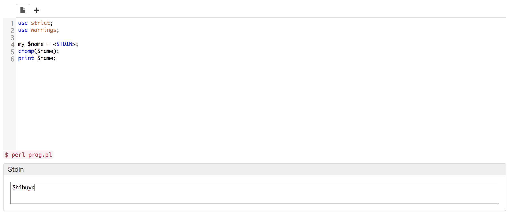

# 回答例

## 練習問題 2-1

> あなたの名前やIDのアルファベット表記をスカラー変数に格納し, スカラー変数に格納した文字列を`print`関数で出力するコードを書いてみましょう

### 例

```perl
use strict;
use warnings;

my $name = "Shibuya";
print $name;
```

### 出力

```
Shibuya
```

## 練習問題 2-2

> 標準入力であなたの名前やIDを入力して, その文字列を`print`関数で出力するコードを書いてみましょう

### 例

```perl
use strict;
use warnings;

my $name = <STDIN>;
chomp($name);
print $name;
```



### 出力

```
Shibuya
```

